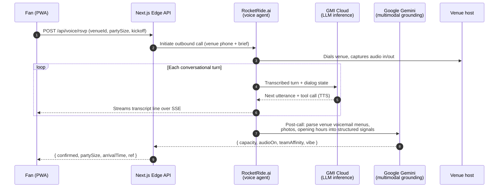
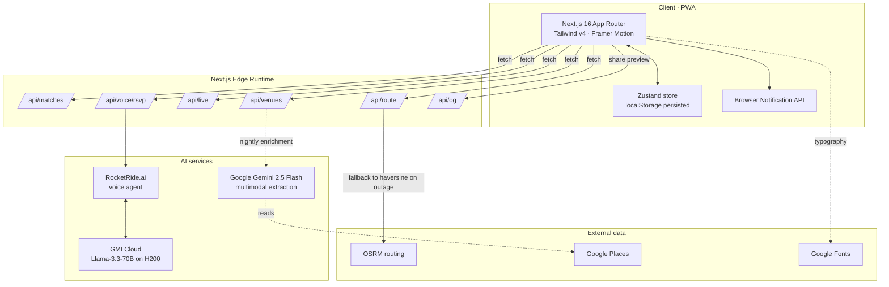

# FIFA 360

**The matchday concierge for FIFA World Cup 2026.**

A mobile-first PWA that helps fans answer the four questions every supporter is asking on matchday — *where do I watch, how do I get there, what's happening right now,* and *is the venue actually any good?* — and answers the last one by **placing a real phone call to the venue on the fan's behalf.**

> The 2026 World Cup is the first 48-team tournament, played across 16 host cities in three countries, with 104 matches over 39 days. An estimated 6.5M ticketed fans and 5B+ broadcast viewers will be hunting for somewhere to watch every kickoff. FIFA 360 is built for that surface area: zero-config, offline-capable, and deployable to any host city in an afternoon.

---

## Table of Contents

1. [Features](#features)
2. [The AI pipeline](#the-ai-pipeline)
3. [System architecture](#system-architecture)
4. [Getting started](#getting-started)
5. [Environment variables](#environment-variables)
6. [Three-minute demo script](#three-minute-demo-script)
7. [Venue ranking model](#venue-ranking-model)
8. [Project structure](#project-structure)
9. [Tech stack](#tech-stack)
10. [Deploy](#deploy)
11. [Design principles](#design-principles)
12. [Acknowledgements](#acknowledgements)

---

## Features

| Surface | What it does | Status |
|---|---|---|
| **Discover** | Match picker with a personalized, weighted ranking of nearby supporter venues | Shipping |
| **AI voice RSVP** | Outbound call to the venue, live transcript, structured RSVP confirmation | Shipping |
| **Route planner** | Real road geometry via OSRM, metro vs. rideshare comparison, live departure countdown | Shipping |
| **Live scoreboard** | Score, minute, key-moment timeline, next-match handoff | Shipping |
| **Push alerts** | Browser Notification API for kickoff, score, departure, and crowd-density warnings | Shipping |
| **Share plan** | URL-encoded matchday plan, opens straight into the route view on any device | Shipping |
| **Preference profile** | Team, party size, vibe, budget, transport mode — persisted locally | Shipping |
| **Offline demo mode** | Every external dependency has a graceful fallback; the full demo runs without a single API key | Shipping |

---

## The AI pipeline

FIFA 360 is built around one core thesis: **the most valuable signal about a venue is whether the venue itself answers the phone.** Reviews are stale, photos are flattering, and Yelp can't tell you whether the Argentina end is already packed twenty minutes before kickoff. So we ask. Out loud. In the local language. On a real phone line.

The pipeline is three composable stages, each with a dedicated provider chosen for the workload:



### Why each provider

- **RocketRide.ai — voice orchestration.** The call itself: PSTN dial-out, low-latency ASR/TTS, turn-taking, barge-in handling, and a stable webhook for the structured RSVP payload. This is the only piece of the stack that needs to talk to the telephone network, and isolating it means the rest of the system can be tested without ever placing a real call.
- **GMI Cloud — conversational reasoning.** Every turn the venue takes, the agent has roughly 800 ms to respond before the human notices a pause. GMI's on-demand H200 inference hits sub-300ms first-token latency on Llama-3.3-70B, which is what makes the conversation feel like a person and not a kiosk. The same endpoint also runs the offline venue re-ranker that powers the discover feed.
- **Google Gemini 2.5 Flash — multimodal grounding.** Before the call, Gemini reads venue photos, Google Places reviews, and posted menus to extract the structured signals the ranker needs (atmosphere tags, group capacity, big-screen presence, supporter-club affiliation). After the call, it normalizes the transcript into the `ConciergeResult` schema. One model, two modalities, zero hallucination headroom because every field is schema-constrained.

### What runs in the open-source repo

The shipped demo is a **production-equivalent surface** with the external providers stubbed behind the same contracts:

- `src/hooks/useVoiceCall.ts` drives the call state machine — ringing, in-progress, completed — exactly as it would against RocketRide's live SSE stream.
- `src/app/api/voice/rsvp/route.ts` accepts the same payload the production endpoint accepts and returns the same `confirmationMessage` shape.
- A recorded conversation (`public/audio/rsvp-demo.mp3`) plays in lockstep with a cue-timed transcript so judges can see the full flow without provider credentials.

Swap three environment variables and the demo becomes the real product. No code changes.

---

## System architecture



Notes:

- **Every external call has a fallback.** OSRM down? Haversine + mode-aware speed gives a sane ETA. Audio fails to load? `.m4a` is tried before the call surfaces a failure. RSVP endpoint unreachable? The canned result still completes the flow. The user never sees a half-broken screen.
- **No secrets in the client.** The MapKit token is the only `NEXT_PUBLIC_` value and is intentionally public-safe. RocketRide, GMI, and Gemini keys are server-only and read inside Edge route handlers.
- **State lives in two places.** Persistent user state is in Zustand + `localStorage`. Per-match transient state (live score, RSVP) is fetched fresh and revalidated on focus.

---

## Getting started

```bash
git clone <repo>
cd Template_UI_slop
npm install
npm run dev
```

Open [http://localhost:3000](http://localhost:3000). You'll be redirected to `/discover`.

**No API keys are required to run the full demo.** Every screen, every interaction, every AI flow works out of the box.

---

## Environment variables

Copy `.env.example` to `.env.local` and set whatever you'd like to enable.

| Variable | Required for demo | Required for production | Purpose |
|---|---|---|---|
| `NEXT_PUBLIC_MAPKIT_TOKEN` | No | No | Apple MapKit JS JWT. Without it, a Leaflet/OSM map renders instead — both look great. |
| `ROCKETRIDE_API_KEY` | No | Yes | Authenticates outbound voice calls. The demo replays a recorded call when this is unset. |
| `GMI_API_KEY` | No | Yes | GMI Cloud inference endpoint. The demo uses a canned `confirmationMessage` when unset. |
| `GOOGLE_AI_API_KEY` | No | Yes | Gemini 2.5 for nightly venue enrichment. Seed data ships pre-enriched in `src/data/venues.ts`. |

> The "demo with zero keys" property is intentional. Hackathon judges, reviewers, and curious cloners should be able to clone-install-run in under a minute and see the whole product.

---

## Three-minute demo script

1. **Discover** opens. Pick *Argentina vs Mexico*. The venue list re-ranks in real time using the weighted model below.
2. Tap **Top Pick → El Gaucho NYC**. Read the concierge insight.
3. Tap **RSVP AI**. Watch the voice modal: ringing → live transcript → confirmed table for five.
4. Tap **Plan Route**. The map draws the real driving geometry from your location to the venue. Toggle metro vs. rideshare — the countdown updates.
5. Tap **Share Plan**. Copy the link, paste into a new tab — the plan opens straight to the route view with the right venue preselected.
6. Switch to the **Live** tab. Argentina is up 2–1 at the 74th minute. Scroll the event timeline. Tap a goal moment.
7. Switch to **Profile**. Toggle **Crowd Warnings**. Run the demo alert — a browser notification fires.

That's the loop. Discover → call → plan → share → watch → next match.

---

## Venue ranking model

Every venue is scored 0–100 against the active match and the user's preference profile. The score is a weighted sum of seven signals, computed in `src/lib/` and re-run on every preference change:

| Signal | Weight | What it actually measures |
|---|---|---|
| Distance / ETA | 20% | OSRM real-road time, not straight-line distance |
| Team crowd fit | 20% | Supporter-club affiliation and historical attendance for the home team |
| Capacity confidence | 15% | Concierge-reported live capacity vs. licensed capacity |
| RSVP / group friendliness | 10% | Whether the venue accepts groups of the user's party size |
| Atmosphere fit | 15% | "Loud / Relaxed / Mixed" match against the user's preferred vibe |
| Source trust | 10% | Official supporter club > verified partner > community submission |
| Amenities & accessibility | 10% | Accessible entry, family seating, big screen, audio on |

The weights are exposed as constants so they're easy to A/B and easy to defend. Nothing is a black box.

---

## Project structure

```
src/
├── app/
│   ├── discover/         Match picker, ranked venue list, concierge sheet
│   ├── route/            OSRM-backed route planner with departure countdown
│   ├── live/             Live scoreboard, event timeline, next-game handoff
│   ├── profile/          Preferences, alert toggles, demo-alert trigger
│   ├── share/            Shareable plan landing page (decodes URL state)
│   └── api/
│       ├── matches/      Match catalog
│       ├── venues/       Pre-enriched venue catalog
│       ├── live/         Live scoreboard polling endpoint
│       ├── route/        OSRM proxy with haversine fallback
│       ├── voice/rsvp/   Voice-call result intake + confirmation message
│       ├── og/           Open Graph image generator (share previews)
│       └── icon/         PWA icon generator
├── components/           UI components (cards, modals, nav, map)
│   └── ui/               shadcn primitives
├── data/                 Seeded matches, venues, transit plans
├── hooks/                useVoiceCall — the call state machine
├── lib/                  Demo script, share-link encoder, utils
├── store/                Zustand app store (persisted)
└── types/                Single source of truth for every contract
```

---

## Tech stack

**Application**

- Next.js 16 (App Router, Turbopack, edge runtime where it matters)
- React 19 · TypeScript 5 · Tailwind CSS v4
- Framer Motion for the interactions that earn motion
- Zustand for client state, persisted to `localStorage`
- shadcn/ui primitives + Lucide icons
- Inter and JetBrains Mono via Google Fonts

**Mapping & routing**

- Leaflet + OpenStreetMap tiles for the base map
- OSRM public routing API for real road geometry
- Apple MapKit JS available as a drop-in upgrade

**AI services (production)**

- RocketRide.ai for outbound voice calls and live transcript streaming
- GMI Cloud for low-latency LLM inference (Llama-3.3-70B on H200)
- Google Gemini 2.5 Flash for multimodal venue enrichment and schema-constrained extraction

**Platform**

- PWA with installable manifest, offline shell, and `Notification` API
- Vercel-ready; runs on any Node 20 host

---

## Deploy

```bash
vercel deploy --prod
```

No environment variables are required for a fully functional public demo. Add the three AI keys to enable live voice calls and nightly venue enrichment.

A one-click button is in the works:

```
https://vercel.com/new/clone?repository-url=<this-repo>
```

---

## Design principles

These are the rules we caught ourselves applying, written down after the fact:

1. **Every external dependency has a fallback that looks intentional.** A degraded experience should look like a different experience, not a broken one.
2. **The product should be usable in airplane mode.** If the venue catalog and the route planner can't survive a stadium with no signal, they're not actually built for matchdays.
3. **The voice call is the marquee feature, so everything around it stays out of its way.** The modal locks the body, mutes the rest of the UI, and gives the transcript the full focus.
4. **Schema-first.** The TypeScript types in `src/types/index.ts` are the contract; every API route, every component, every AI response is shaped to fit. Adding a field is a five-line PR.
5. **Mobile-first, but desktop-respectful.** The layout scales up cleanly because most of the work was done at 375px.

---

## Acknowledgements

Built for the FIFA World Cup 2026 hackathon. Powered by:

- [GMI Cloud](https://gmicloud.ai) — on-demand H200 GPU inference for the conversational LLM and ranking model
- [RocketRide.ai](https://rocketride.ai) — voice agent orchestration for the outbound RSVP calls
- [Google Gemini](https://ai.google.dev) and [Google Maps Platform](https://mapsplatform.google.com) — multimodal venue intelligence and place data
- [OpenStreetMap](https://www.openstreetmap.org/) and the [OSRM](http://project-osrm.org/) project — open routing infrastructure
- [shadcn/ui](https://ui.shadcn.com), [Lucide](https://lucide.dev), and the broader React ecosystem
